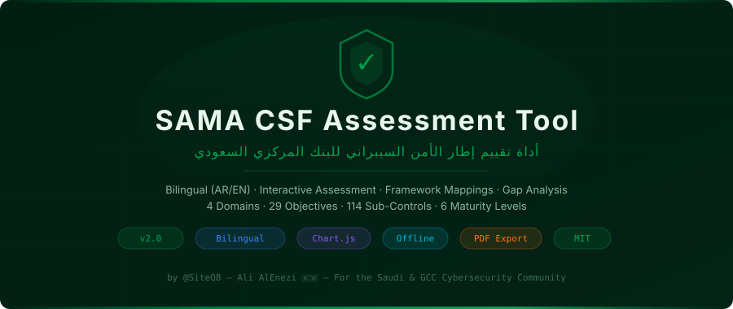
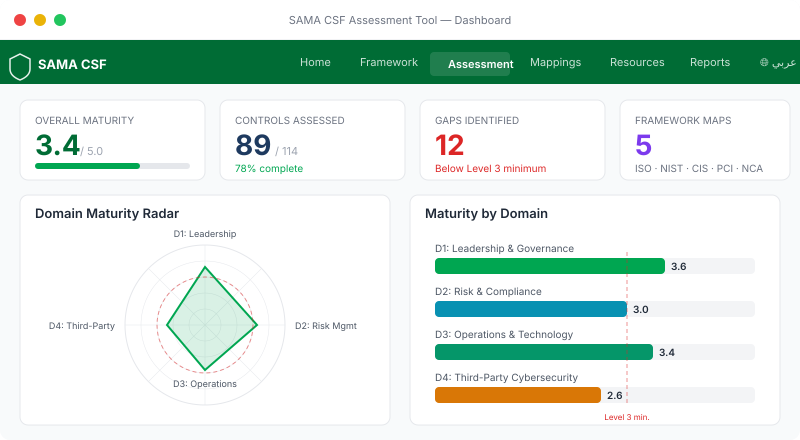
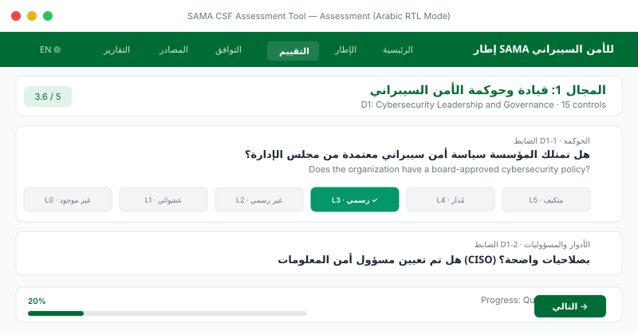
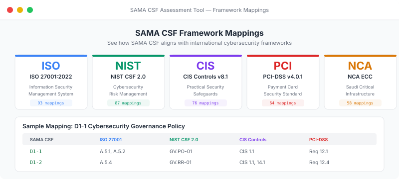

<p align="center">
  
</p>

<p align="center">
  <a href="#-getting-started"></a>
  <a href="LICENSE"></a>
  <a href="#"></a>
  <a href="#"></a>
  <a href="https://github.com/SiteQ8/sama-csf-assessment/stargazers"></a>
  <a href="https://github.com/SiteQ8/sama-csf-assessment/issues"></a>
  <a href="#"></a>
  <a href="#"></a>
</p>

<p align="center">
  <a href="#-features--المميزات">Features</a> •
  <a href="#-screenshots">Screenshots</a> •
  <a href="#-getting-started--البدء">Quick Start</a> •
  <a href="#-framework-mappings">Mappings</a> •
  <a href="#-contributing">Contributing</a>
</p>

---

<div dir="rtl">

## نظرة عامة

أداة تعليمية تفاعلية لتقييم مدى الامتثال لإطار الأمن السيبراني للبنك المركزي السعودي (SAMA CSF). تم تصميم هذه الأداة لأغراض التعلم والتطوير الشخصي في مجال الأمن السيبراني.

</div>

## Overview

An interactive educational tool for assessing compliance with the Saudi Central Bank (SAMA) Cybersecurity Framework. Built as a pure client-side application — **no server required, all data stays in your browser**.

> Built for the **Saudi & GCC Cybersecurity Community** 🇸🇦🇰🇼🇦🇪🇧🇭🇶🇦🇴🇲

---

## 📸 Screenshots

### Interactive Dashboard
Real-time maturity radar, domain bar charts, gap identification, and framework mapping stats.

<p align="center">
  
</p>

### Bilingual Assessment (Arabic RTL)
Full Arabic/English assessment interface with 6-level maturity scoring per control.

<p align="center">
  
</p>

### Framework Mappings
Cross-reference SAMA CSF with ISO 27001, NIST CSF 2.0, CIS Controls, PCI-DSS, and NCA ECC.

<p align="center">
  
</p>

---

## 📋 SAMA CSF Framework Structure

| Component | Count |
|-----------|-------|
| Core Domains | 4 |
| Control Objectives | 29 |
| Sub-Controls | 114 |
| Maturity Levels | 6 (0–5) |

### Domains

| # | Domain (EN) | المجال (AR) |
|---|-------------|-------------|
| D1 | Cybersecurity Leadership & Governance | قيادة وحوكمة الأمن السيبراني |
| D2 | Cybersecurity Risk Management & Compliance | إدارة المخاطر والامتثال السيبراني |
| D3 | Cybersecurity Operations & Technology | عمليات وتقنية الأمن السيبراني |
| D4 | Third-Party Cybersecurity | أمن الأطراف الخارجية |

### Maturity Levels

| Level | Name (EN) | الاسم (AR) | Color |
|-------|-----------|------------|-------|
| 0 | Non-Existent | غير موجود | 🔴 |
| 1 | Ad-hoc | عشوائي | 🟠 |
| 2 | Repeatable but Informal | قابل للتكرار لكن غير رسمي | 🟡 |
| 3 | **Structured & Formalized** ⭐ | **منظم ورسمي** ⭐ | 🟢 |
| 4 | Managed & Measurable | مُدار وقابل للقياس | 🔵 |
| 5 | Adaptive | متكيف | 🟣 |

> ⭐ **Level 3 is the minimum required** by SAMA for all regulated entities.

---

## ✨ Features | المميزات

| Feature | Description | الوصف |
|---------|-------------|-------|
| 🛡️ **Full SAMA CSF Assessment** | Evaluate across 4 domains, 29 objectives, 114 sub-controls | تقييم شامل عبر جميع المجالات |
| 🌐 **Bilingual AR/EN** | Complete RTL Arabic + LTR English with live toggle | واجهة ثنائية اللغة مع دعم RTL |
| 📊 **Interactive Dashboard** | Radar charts, bar graphs, maturity indicators | لوحة تحكم تفاعلية مع مخططات |
| 🔗 **Framework Mappings** | ISO 27001, NIST CSF 2.0, CIS v8.1, PCI-DSS, NCA | ربط مع الأطر الدولية |
| 🔍 **Gap Analysis** | Identify controls below Level 3 with recommendations | تحليل الفجوات مع توصيات |
| 📄 **PDF Reports** | Executive summary + detailed action plans | تقارير PDF مع ملخص تنفيذي |
| 💾 **Offline-First** | 100% browser-based, localStorage persistence | تعمل بدون اتصال |
| 📱 **Responsive** | Desktop, tablet, and mobile optimized | تصميم متجاوب |
| 🌙 **Dark Mode** | Light/dark theme toggle | وضع داكن |

---

## 🚀 Getting Started | البدء

### GitHub Pages (Recommended)

1. Fork this repository
2. Go to **Settings → Pages**
3. Select source: `main` branch and `/docs` folder
4. Your site publishes at `https://[username].github.io/sama-csf-assessment/`

### Local Development

```bash
# Clone
git clone https://github.com/SiteQ8/sama-csf-assessment.git
cd sama-csf-assessment

# Open directly - no build required (pure HTML/CSS/JS)
open docs/index.html
# or
python3 -m http.server 8080 -d docs
```

Open [http://localhost:8080](http://localhost:8080)

> **Zero dependencies** — no npm, no build tools. Just open the HTML file.

---

## 🔗 Framework Mappings

SAMA CSF maps to 5 international frameworks:

| Framework | Version | Relevance | Mappings |
|-----------|---------|-----------|----------|
| **ISO 27001** | 2022 | Information Security Management | ~93 |
| **NIST CSF** | 2.0 | Cybersecurity Risk Management | ~87 |
| **CIS Controls** | v8.1 | Practical Security Safeguards | ~76 |
| **PCI-DSS** | v4.0.1 | Payment Card Security | ~64 |
| **NCA ECC** | Latest | Saudi Critical Infrastructure Controls | ~58 |

---

## 🛠️ Tech Stack

| Component | Technology |
|-----------|-----------|
| Frontend | Pure HTML5 / CSS3 / JavaScript ES6+ |
| Charts | Chart.js |
| PDF Export | jsPDF |
| Storage | Browser localStorage |
| Styling | Custom CSS (Grid + Flexbox) |
| Icons | Lucide / Heroicons |
| Fonts | Cairo (Arabic) + Inter (English) |
| Hosting | GitHub Pages (static) |

---

## 📁 Project Structure

```
sama-csf-assessment/
├── docs/                        # GitHub Pages root
│   ├── index.html               # Main application (370 lines)
│   ├── app.js                   # Application logic + framework data
│   ├── style.css                # Full styling with RTL support
│   └── screenshots/             # Documentation screenshots
├── SECURITY.md                  # Security policy
├── CONTRIBUTING.md              # Contribution guidelines
├── CODE_OF_CONDUCT.md           # Code of conduct
├── CHANGELOG.md                 # Version history
├── LICENSE                      # MIT License
└── README.md                    # This file
```

---

## 🗺️ Roadmap

- [ ] Additional assessment questions with deeper control granularity
- [ ] Evidence attachment support per control
- [ ] Remediation tracker with priorities and timelines
- [ ] Historical assessment comparison (trend analysis)
- [ ] Export to Excel with framework mapping sheets
- [ ] Print-optimized report layout
- [ ] Service Worker for full PWA offline support
- [ ] Accessibility (WCAG 2.1 AA) improvements

---

## 🤝 Contributing

Contributions from the GCC cybersecurity community are welcome!

See [CONTRIBUTING.md](CONTRIBUTING.md) for guidelines.

### Areas for Contribution

- 📝 **Assessment Questions** — Add or improve control descriptions
- 🌐 **Translation** — Improve Arabic translations
- 🔗 **Mappings** — Refine framework cross-references
- 🎨 **UI/UX** — Interface improvements and accessibility
- 📊 **Charts** — New visualization types
- 📄 **Reports** — Enhanced PDF/Excel export
- 🐛 **Bug Fixes** — Issue resolution

---

## 🔒 Security

See [SECURITY.md](SECURITY.md) for our security policy.

---

## ⚠️ Disclaimer | إخلاء المسؤولية

<div dir="rtl">

- هذه الأداة غير رسمية وليست معتمدة من البنك المركزي السعودي (SAMA)
- النتائج استرشادية فقط ولا تمثل امتثالا رسميا
- للتقييم الرسمي، يرجى الرجوع إلى الوثائق الرسمية لـ SAMA
- المعلومات المخزنة تبقى في متصفحك فقط ولا ترسل لأي خادم

</div>

- This tool is **unofficial** and not endorsed by the Saudi Central Bank (SAMA)
- Results are for **guidance only** and do not represent official compliance
- For official assessment, refer to [SAMA's official documentation](https://www.sama.gov.sa)
- All data is stored **locally in your browser** and never sent to any server

---

## 📚 Resources | المصادر

- [SAMA Cybersecurity Framework (PDF)](https://www.sama.gov.sa/en-US/Laws/Pages/CyberSecurityFramework.aspx)
- [ISO/IEC 27001:2022](https://www.iso.org/standard/27001)
- [NIST Cybersecurity Framework 2.0](https://www.nist.gov/cyberframework)
- [CIS Controls v8.1](https://www.cisecurity.org/controls)
- [PCI-DSS v4.0.1](https://www.pcisecuritystandards.org)
- [NCA - National Cybersecurity Authority](https://nca.gov.sa)

---

## 📄 License

MIT License — see [LICENSE](LICENSE) for details.

---

<p align="center">
  <sub>صنع بـ ❤️ للمجتمع السيبراني في السعودية والخليج</sub><br>
  <sub>Built for the Saudi & GCC Cybersecurity Community by <a href="https://github.com/SiteQ8">@SiteQ8</a> — Ali AlEnezi 🇰🇼</sub>
</p>
